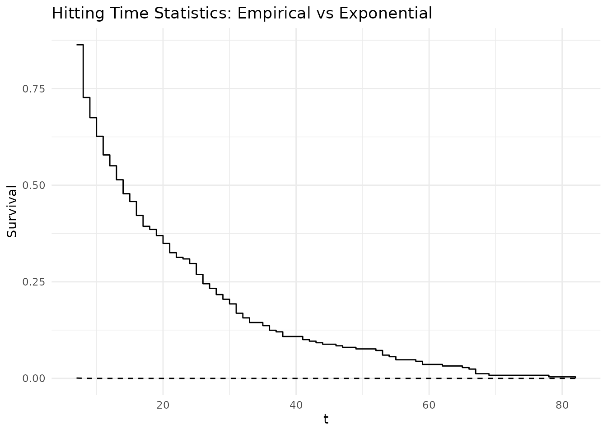

# Estimating the Extremal Index for the Logistic Map

## Introduction

The extremal index $`\theta`$ is a key parameter in extreme value theory
that measures the degree of clustering in extreme events. For a
stationary sequence, $`\theta \in (0, 1]`$ where:

- $`\theta = 1`$ indicates no clustering (extremes occur in isolation)
- $`\theta < 1`$ indicates clustering (extremes tend to occur in groups)

This vignette demonstrates how to estimate $`\theta`$ for the chaotic
logistic map using the **chaoticds** package.

## The Logistic Map

The logistic map is defined as: $`x_{n+1} = r x_n (1 - x_n)`$

For $`r = 3.8`$, the map exhibits chaotic behavior with interesting
extreme value properties.

``` r

library(chaoticds)

# Load the pre-generated dataset
data(logistic_ts)

# Basic properties
cat("Time series length:", length(logistic_ts), "\n")
#> Time series length: 5000
cat("Range: [", round(min(logistic_ts), 3), ",", round(max(logistic_ts), 3), "]\n")
#> Range: [ 0.181 , 0.95 ]
cat("Mean:", round(mean(logistic_ts), 3), "\n")
#> Mean: 0.642
```

``` r

plot(logistic_ts[1:1000], type = "l", 
     main = "Logistic Map Time Series (r = 3.8)",
     xlab = "Time", ylab = "Value")
```


Logistic map time series (first 1000 observations)

## Threshold Selection

Choosing an appropriate threshold is crucial for extremal index
estimation. We use diagnostic plots to guide our selection.

``` r

# Define candidate thresholds
thresholds <- quantile(logistic_ts, probs = seq(0.85, 0.98, by = 0.01))

# Mean Residual Life plot for threshold selection
mrl_data <- mean_residual_life(logistic_ts, thresholds)
```

``` r

mrl_plot(mrl_data)
```


Mean Residual Life plot for threshold selection

For this analysis, we’ll use the 95th percentile as our threshold:

``` r

threshold <- quantile(logistic_ts, 0.95)
cat("Selected threshold:", round(threshold, 4), "\n")
#> Selected threshold: 0.9432

# Number of exceedances
exc <- exceedances(logistic_ts, threshold)
cat("Number of exceedances:", length(exc), "\n")
#> Number of exceedances: 250
cat("Exceedance rate:", round(length(exc)/length(logistic_ts), 3), "\n")
#> Exceedance rate: 0.05
```

## Extremal Index Estimation

### Runs Estimator

The runs estimator counts clusters based on run lengths:

``` r

# Try different run lengths
run_lengths <- 1:8
theta_runs_vec <- sapply(run_lengths, function(r) {
  result <- extremal_index_runs(logistic_ts, threshold, run_length = r)
  if(length(result) == 0) NA else result
})

# Display results
results_df <- data.frame(
  run_length = run_lengths,
  theta_estimate = theta_runs_vec
)
print(results_df)
#>   run_length theta_estimate
#> 1          1          1.000
#> 2          2          1.000
#> 3          3          1.000
#> 4          4          1.000
#> 5          5          1.000
#> 6          6          1.000
#> 7          7          0.864
#> 8          8          0.728
```

### Intervals Estimator

The intervals estimator provides an alternative approach:

``` r

theta_intervals <- extremal_index_intervals(logistic_ts, threshold)
cat("Intervals estimator result:", theta_intervals, "\n")
#> Intervals estimator result: 3
```

## Cluster Analysis

Understanding the structure of extreme clusters provides additional
insight:

``` r

# Analyze cluster sizes with smaller run length to find clusters
sizes <- cluster_sizes(logistic_ts, threshold, run_length = 1)

if(length(sizes) > 0) {
  cat("Cluster statistics:\n")
  summary_stats <- cluster_summary(sizes)
  cat("  Number of clusters:", length(sizes), "\n")
  cat("  Mean cluster size:", round(summary_stats[["mean_size"]], 2), "\n")
  cat("  Cluster size variance:", round(summary_stats[["var_size"]], 2), "\n")
  cat("  Max cluster size:", max(sizes), "\n")
} else {
  cat("No clusters found\n")
}
#> Cluster statistics:
#>   Number of clusters: 250 
#>   Mean cluster size: 1 
#>   Cluster size variance: 0 
#>   Max cluster size: 1
```

## Hitting Time Analysis

Hitting times provide another perspective on extremal behavior:

``` r

# Calculate hitting times
hts <- hitting_times(logistic_ts, threshold)

if(length(hts) > 0) {
  cat("Hitting time statistics:\n")
  cat("  Number of hitting times:", length(hts), "\n")
  cat("  Mean hitting time:", round(mean(hts), 2), "\n")
  cat("  Median hitting time:", median(hts), "\n")
  
  # Plot hitting times if we have a valid theta estimate
  valid_theta <- theta_runs_vec[!is.na(theta_runs_vec)]
  if(length(valid_theta) > 0) {
    plot_hts(hts, valid_theta[1])
  }
}
#> Hitting time statistics:
#>   Number of hitting times: 249 
#>   Mean hitting time: 20 
#>   Median hitting time: 14
```



## Conclusions

This analysis demonstrates the estimation of the extremal index for the
chaotic logistic map. The logistic map exhibits complex extreme value
behavior that can be characterized using the tools in the **chaoticds**
package.

## Further Reading

- Leadbetter, M.R., Lindgren, G., & Rootzén, H. (1983). *Extremes and
  Related Properties of Random Sequences and Processes*
- Freitas, A.C.M., Freitas, J.M., & Todd, M. (2010). Hitting time
  statistics and extreme value theory. *Probability Theory and Related
  Fields*
- Lucarini, V. et al. (2016). *Extremes and Recurrence in Dynamical
  Systems*
