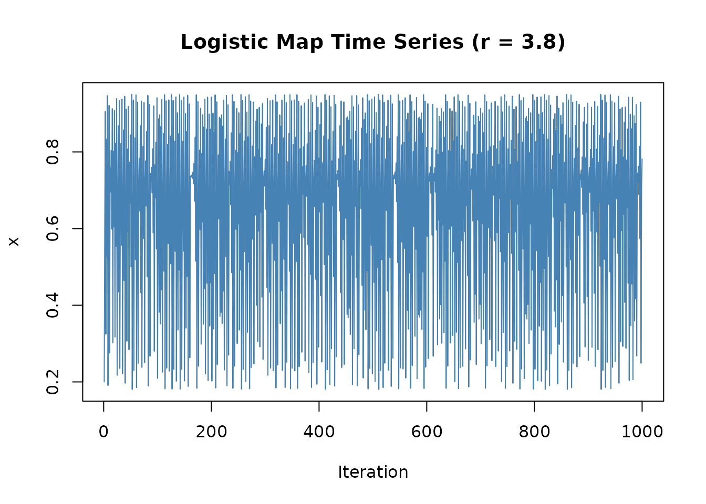
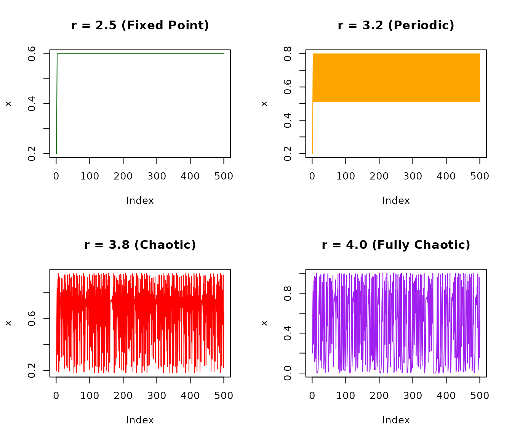
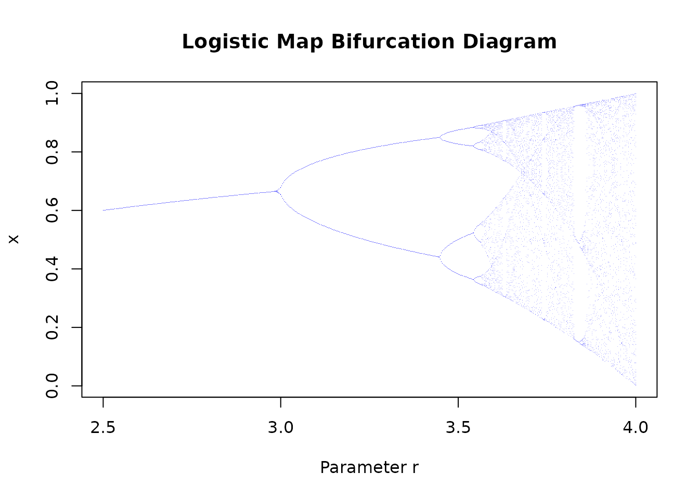
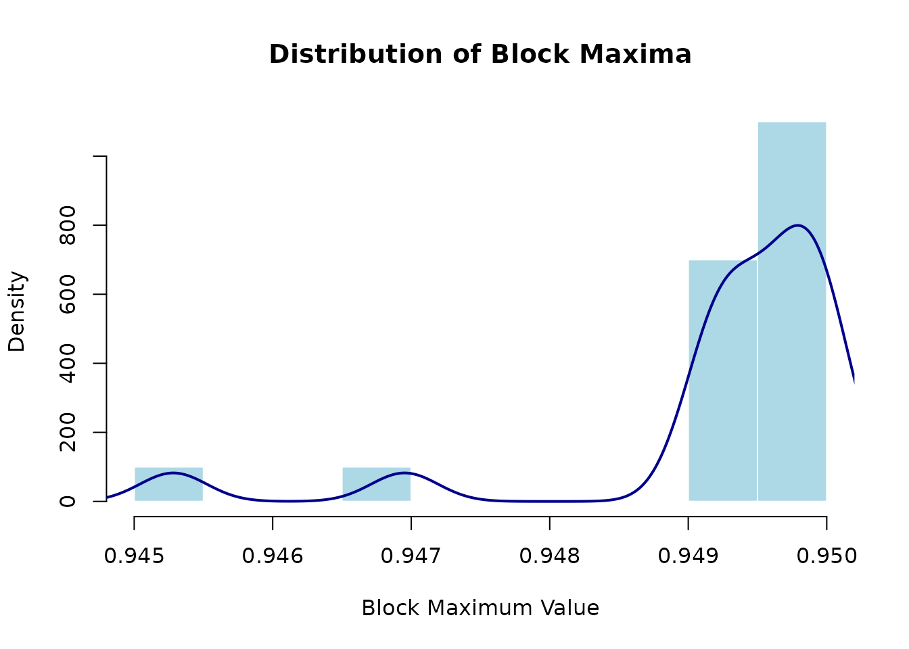
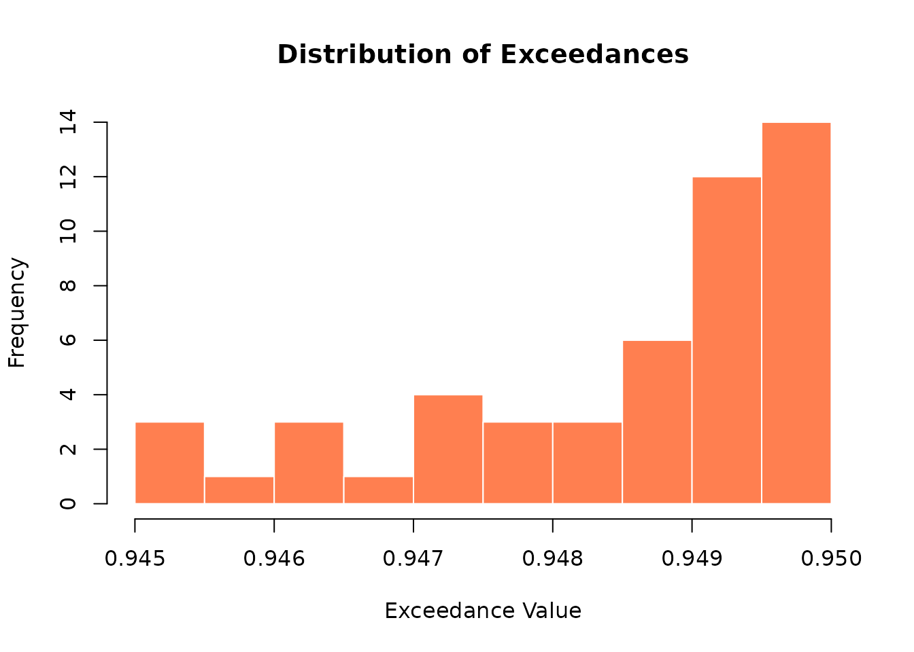
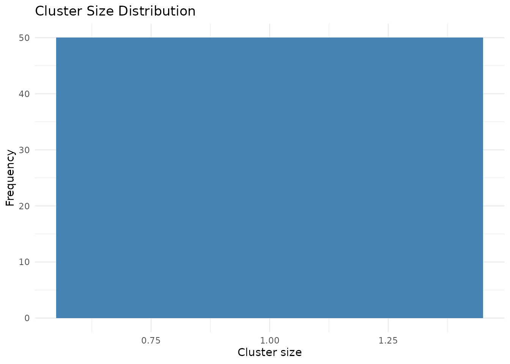
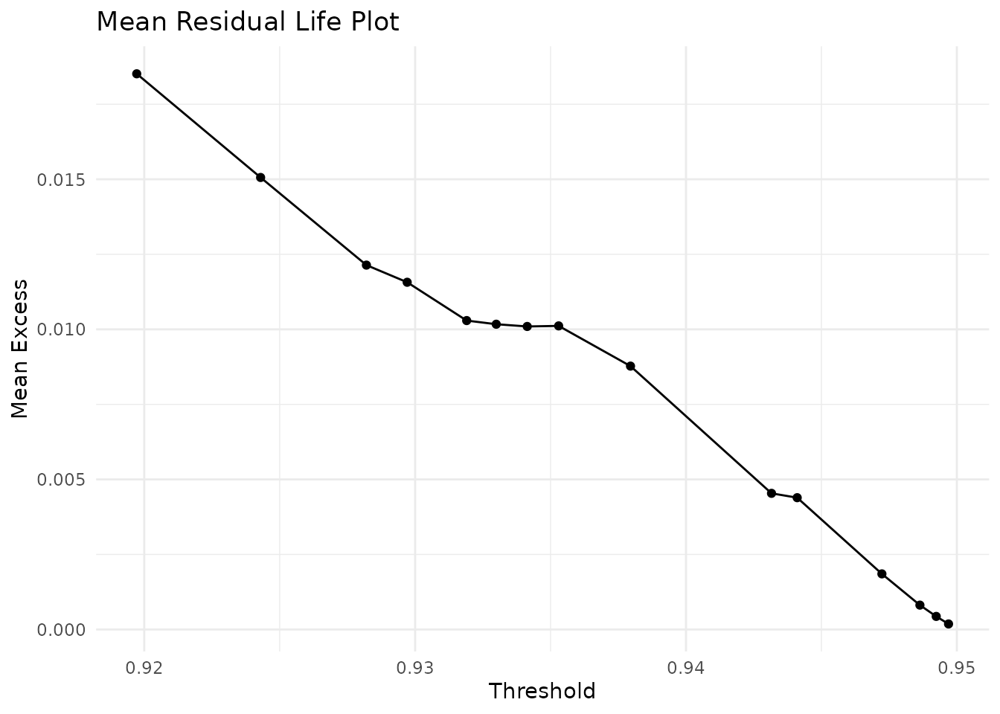
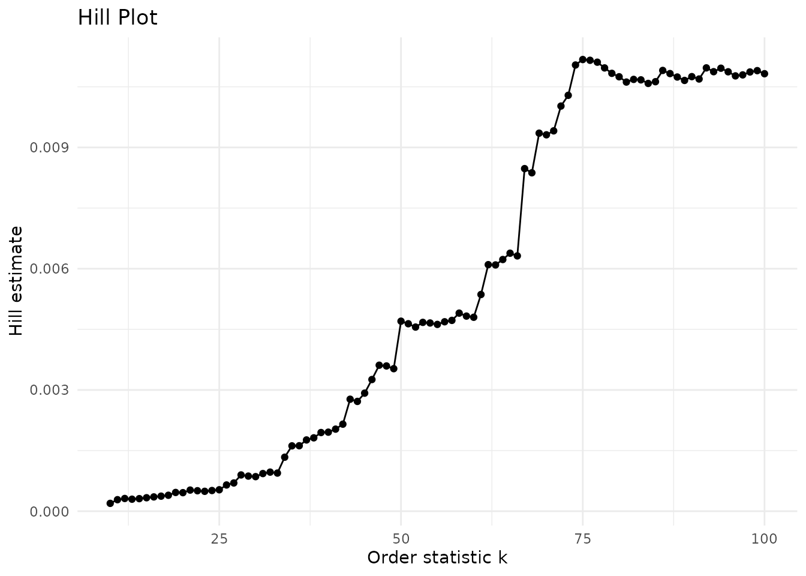
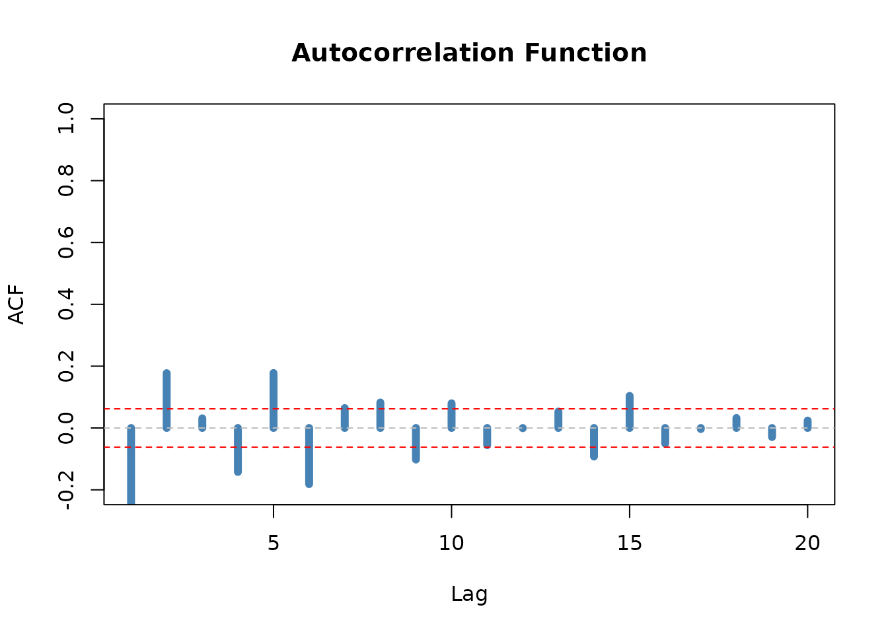

# Getting Started with chaoticds

## Welcome!

This vignette provides a gentle introduction to the `chaoticds` package.
You’ll learn:

- How to simulate chaotic dynamical systems
- How to perform extreme value analysis
- How to estimate the extremal index
- How to interpret results and create visualizations

**Estimated time:** 15-20 minutes

------------------------------------------------------------------------

## What is chaoticds?

The `chaoticds` package provides tools for analyzing **extreme events**
in **chaotic dynamical systems**.

### Why is this important?

Chaotic systems appear everywhere:

- **Climate dynamics**: Temperature extremes, hurricanes
- **Financial markets**: Market crashes, volatility spikes
- **Turbulent flows**: Extreme velocities in fluids
- **Biological systems**: Population dynamics

Traditional statistical methods assume **independence**, but extreme
events in chaotic systems tend to **cluster together**. The extremal
index θ quantifies this clustering.

------------------------------------------------------------------------

## Installation

``` r

# From GitHub (development version)
devtools::install_github("DiogoRibeiro7/chaotic-dynamical-systems")

# From CRAN (when available)
install.packages("chaoticds")
```

Load the package:

``` r

library(chaoticds)
```

------------------------------------------------------------------------

## Part 1: Simulating Chaotic Dynamics

### The Logistic Map

The logistic map is one of the simplest chaotic systems:

``` math
x_{n+1} = r \cdot x_n \cdot (1 - x_n)
```

Let’s simulate it!

``` r

# Generate 1000 iterations with r = 3.8 (chaotic regime)
series <- simulate_logistic_map(n = 1000, r = 3.8, x0 = 0.2)

# Visualize
plot(series, type = "l", main = "Logistic Map Time Series (r = 3.8)",
     xlab = "Iteration", ylab = "x", col = "steelblue")
```



**What do we see?**

- No apparent pattern
- Irregular fluctuations
- This is deterministic chaos!

### Understanding the Parameter r

The dynamics change dramatically with r:

``` r

par(mfrow = c(2, 2))

# r = 2.5: Convergence to fixed point
series1 <- simulate_logistic_map(500, r = 2.5, x0 = 0.2)
plot(series1, type = "l", main = "r = 2.5 (Fixed Point)", ylab = "x", col = "darkgreen")

# r = 3.2: Period-2 oscillation
series2 <- simulate_logistic_map(500, r = 3.2, x0 = 0.2)
plot(series2, type = "l", main = "r = 3.2 (Periodic)", ylab = "x", col = "orange")

# r = 3.8: Chaos
series3 <- simulate_logistic_map(500, r = 3.8, x0 = 0.2)
plot(series3, type = "l", main = "r = 3.8 (Chaotic)", ylab = "x", col = "red")

# r = 4.0: Fully chaotic
series4 <- simulate_logistic_map(500, r = 4.0, x0 = 0.2)
plot(series4, type = "l", main = "r = 4.0 (Fully Chaotic)", ylab = "x", col = "purple")
```



``` r


par(mfrow = c(1, 1))
```

### Bifurcation Diagram

Visualize how dynamics change across parameter values:

``` r

# Generate bifurcation data
r_values <- seq(2.5, 4, length.out = 500)
bif_data <- logistic_bifurcation(r_values, n_iter = 300, discard = 250)

# Plot
plot(bif_data$r, bif_data$x, pch = ".", cex = 0.3,
     main = "Logistic Map Bifurcation Diagram",
     xlab = "Parameter r", ylab = "x",
     col = rgb(0, 0, 1, 0.3))
```



**Interpretation:**

- **r \< 3**: Single values (fixed points)
- **3 \< r \< 3.57**: Branching pattern (period doubling)
- **r \> 3.57**: Dense cloud (chaos)

------------------------------------------------------------------------

## Part 2: Extreme Value Analysis

Now let’s analyze extreme events in our chaotic time series.

### Method 1: Block Maxima

Divide the series into blocks and extract the maximum from each:

``` r

# Use chaotic series from r = 3.8
block_size <- 50
bm <- block_maxima(series, block_size)

cat("Original series length:", length(series), "\n")
#> Original series length: 1000
cat("Number of block maxima:", length(bm), "\n")
#> Number of block maxima: 20
cat("Block maxima range: [", round(min(bm), 3), ",", round(max(bm), 3), "]\n")
#> Block maxima range: [ 0.945 , 0.95 ]

# Visualize distribution
hist(bm, breaks = 15, col = "lightblue", border = "white",
     main = "Distribution of Block Maxima",
     xlab = "Block Maximum Value", prob = TRUE)
lines(density(bm), col = "darkblue", lwd = 2)
```



### Fitting the Generalized Extreme Value (GEV) Distribution

``` r

# Fit GEV on a longer deterministic sample so the observed information
# matrix is stable across R/evd versions used by CRAN and CI builders.
gev_series <- simulate_logistic_map(n = 5000, r = 3.8, x0 = 0.2)
gev_fit <- fit_gev(block_maxima(gev_series, block_size = 50))

# Display results
print(gev_fit)
#> <chaotic_model>
#>   Model:  gev
#>   Method: evd::fgev
#>   Parameters:
#>       loc     scale     shape 
#>  0.947400  0.002132 -0.689030
```

**Interpretation:**

- **Location (μ)**: Center of the distribution
- **Scale (σ)**: Spread of the distribution
- **Shape (ξ)**: Tail behavior
  - ξ \> 0: Heavy tail (Fréchet)
  - ξ = 0: Light tail (Gumbel)
  - ξ \< 0: Bounded tail (Weibull)

### Method 2: Peaks Over Threshold (POT)

Instead of blocks, extract all values above a high threshold:

``` r

# Select 95th percentile as threshold
threshold <- quantile(series, 0.95)
cat("Threshold:", round(threshold, 4), "\n")
#> Threshold: 0.9441

# Extract exceedances
exc <- exceedances(series, threshold)
cat("Number of exceedances:", length(exc), "\n")
#> Number of exceedances: 50
cat("Exceedance proportion:", length(exc) / length(series), "\n")
#> Exceedance proportion: 0.05

# Visualize
hist(exc, breaks = 10, col = "coral", border = "white",
     main = "Distribution of Exceedances",
     xlab = "Exceedance Value")
```



### Fitting the Generalized Pareto Distribution (GPD)

``` r

# Fit GPD to exceedances
gpd_fit <- fit_gpd(series, threshold)

# Display results
print(gpd_fit)
#> <chaotic_model>
#>   Model:  gpd
#>   Method: evd::fpot
#>   Threshold: 0.9441053
#>   Parameters:
#>    scale    shape 
#> 0.004391 0.000000
```

------------------------------------------------------------------------

## Part 3: The Extremal Index

### What is the Extremal Index?

The extremal index θ ∈ (0, 1\] measures clustering of extreme events:

- **θ = 1**: Extremes occur independently (like IID data)
- **θ \< 1**: Extremes cluster together (typical in chaotic systems)
- **θ = 0.5**: On average, extremes come in pairs

### Estimating θ

``` r

# Runs estimator
run_length <- 2
theta_runs <- extremal_index_runs(series, threshold, run_length)

cat("\nExtremal Index Estimate (Runs Method):\n")
#> 
#> Extremal Index Estimate (Runs Method):
cat("θ =", round(theta_runs, 4), "\n")
#> θ = 1
cat("Interpretation:",
    ifelse(theta_runs < 0.7, "Strong clustering",
           ifelse(theta_runs < 0.9, "Moderate clustering", "Weak clustering")),
    "\n")
#> Interpretation: Weak clustering
```

### Understanding Clusters

``` r

# Identify clusters of exceedances
sizes <- cluster_sizes(series, threshold, run_length)

cat("\nCluster Statistics:\n")
#> 
#> Cluster Statistics:
cat("Number of clusters:", length(sizes), "\n")
#> Number of clusters: 50
cat("Mean cluster size:", round(mean(sizes), 2), "\n")
#> Mean cluster size: 1
cat("Max cluster size:", max(sizes), "\n")
#> Max cluster size: 1

# Visualize cluster sizes
if (length(sizes) > 0) {
  cluster_hist <- cluster_histogram(sizes)
  print(cluster_hist)
}
```



### Bootstrap Confidence Intervals

Get uncertainty estimates for θ:

``` r

# This takes ~30 seconds
boot_result <- bootstrap_extremal_index(
  series,
  threshold,
  run_length = 2,
  B = 1000  # 1000 bootstrap samples
)

cat("Point estimate:", round(boot_result$estimate, 4), "\n")
cat("95% CI: [", round(boot_result$ci[1], 4), ",",
    round(boot_result$ci[2], 4), "]\n")
```

------------------------------------------------------------------------

## Part 4: Threshold Selection

Choosing the right threshold is crucial! Too low → bias. Too high → high
variance.

### Mean Residual Life Plot

``` r

# Compute MRL for various thresholds
thresholds <- quantile(series, seq(0.85, 0.99, by = 0.01))
mrl_data <- mean_residual_life(series, thresholds)

# Create MRL plot
mrl_plot(mrl_data)
```



**How to interpret:**

- Look for linear pattern in upper tail
- Choose threshold where linearity begins
- Trade-off: higher threshold = fewer exceedances

### Hill Plot

``` r

# Compute Hill estimates
k_values <- 10:100
hill_data <- hill_estimates(series, k_values)

# Create Hill plot
hill_plot(hill_data)
```



**How to interpret:**

- Look for stable region (plateau)
- Estimate tail index from plateau
- More stable = better threshold choice

------------------------------------------------------------------------

## Part 5: Diagnostic Checks

### Autocorrelation Function

Check for serial dependence:

``` r

# Compute ACF
lags <- 1:20
acf_values <- acf_decay(series, lags)

# Plot
plot(lags, acf_values, type = "h", lwd = 6, col = "steelblue",
     main = "Autocorrelation Function",
     xlab = "Lag", ylab = "ACF",
     ylim = c(-0.2, 1))
abline(h = 0, col = "gray", lty = 2)
abline(h = c(-1.96/sqrt(length(series)), 1.96/sqrt(length(series))),
       col = "red", lty = 2)
```



### Mixing Diagnostics

Test if extremes satisfy mixing conditions:

``` r

# Check D(u_n) condition at a representative separation lag
d_result <- d_check(series, threshold, r = 10L)
cat(
  "D(u_n) condition satisfied:",
  ifelse(d_result, "YES", "Possibly NO"),
  "\n"
)
#> D(u_n) condition satisfied: YES
```

------------------------------------------------------------------------

## Part 6: Complete Workflow

Put it all together with
[`run_demo()`](https://diogoribeiro7.github.io/chaotic-dynamical-systems/reference/run_demo.md):

``` r

# Comprehensive analysis
results <- run_demo(
  n = 2000,
  r = 3.8,
  x0 = 0.2,
  block_size = 50,
  threshold_q = 0.95,
  output_report = FALSE
)

# Explore results
names(results)
#> [1] "series"          "threshold"       "diagnostics"
#> [4] "block_maxima"    "gev_fit"         "exceedances"
#> [7] "gpd_fit"         "extremal_index"  "cluster_sizes"
#> [10] "cluster_summary" "acf"             "mixing"

# Access components
summary(results$gev_fit)
print(results$extremal_index)
```

------------------------------------------------------------------------

## Next Steps

### Learn More

- 📖
  **[`vignette("estimating-theta-logistic")`](https://diogoribeiro7.github.io/chaotic-dynamical-systems/articles/estimating-theta-logistic.md)**:
  Deep dive into extremal index
- 📖
  **[`vignette("block-maxima-vs-pot-henon")`](https://diogoribeiro7.github.io/chaotic-dynamical-systems/articles/block-maxima-vs-pot-henon.md)**:
  Compare EVT methods
- 📖
  **[`vignette("multivariate-analysis")`](https://diogoribeiro7.github.io/chaotic-dynamical-systems/articles/multivariate-analysis.md)**:
  Multi-dimensional systems
- 📖
  **[`vignette("performance-optimization")`](https://diogoribeiro7.github.io/chaotic-dynamical-systems/articles/performance-optimization.md)**:
  Speed up your analysis

### Try Different Systems

``` r

# Hénon map (2D chaotic attractor)
henon <- simulate_henon_map(n = 5000, a = 1.4, b = 0.3)
plot(henon$x, henon$y, pch = ".", cex = 0.5,
     main = "Hénon Attractor")

# Tent map
tent <- simulate_tent_map(n = 1000, r = 2, x0 = 0.1)

# Lozi map
lozi <- simulate_lozi_map(n = 5000)
```

### Interactive Exploration

``` r

# Launch interactive Shiny app
launch_explorer()
```

------------------------------------------------------------------------

## Getting Help

- **Function documentation**:
  [`?simulate_logistic_map`](https://diogoribeiro7.github.io/chaotic-dynamical-systems/reference/simulate_logistic_map.md)
- **All vignettes**: `browseVignettes("chaoticds")`
- **Package website**:
  <https://diogoribeiro7.github.io/chaotic-dynamical-systems/>
- **Report issues**: [GitHub
  Issues](https://github.com/DiogoRibeiro7/chaotic-dynamical-systems/issues)

------------------------------------------------------------------------

## References

**Key Papers:**

1.  Coles, S. (2001). *An Introduction to Statistical Modeling of
    Extreme Values*. Springer.

2.  Freitas, A. C. M., Freitas, J. M., & Todd, M. (2010). Hitting time
    statistics and extreme value theory. *Probability Theory and Related
    Fields*, 147(3-4), 675-710.

3.  Leadbetter, M. R. (1983). Extremes and local dependence in
    stationary sequences. *Zeitschrift für Wahrscheinlichkeitstheorie
    und verwandte Gebiete*, 65(2), 291-306.

**Further Reading:**

- Embrechts, P., Klüppelberg, C., & Mikosch, T. (1997). *Modelling
  Extremal Events*. Springer.

------------------------------------------------------------------------

## Summary

You’ve learned:

✅ How to simulate chaotic dynamical systems ✅ How to perform extreme
value analysis (block maxima & POT) ✅ How to estimate and interpret the
extremal index ✅ How to select thresholds using diagnostic plots ✅ How
to check model assumptions

**Happy analyzing! 🎉**
