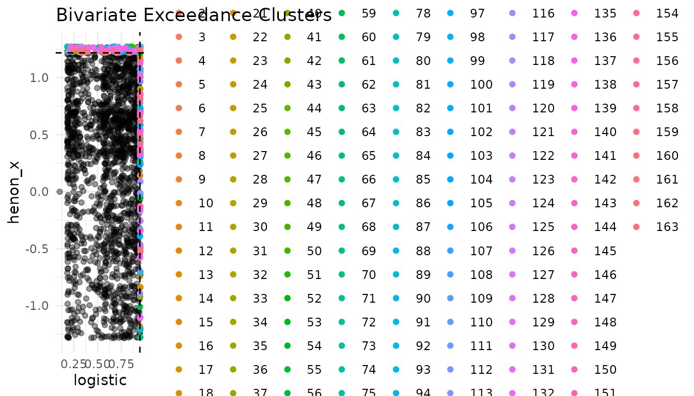
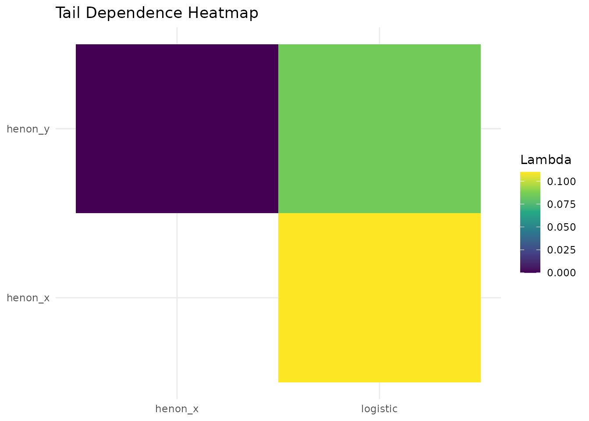

# Multivariate Extreme Value Analysis

## Introduction

This vignette demonstrates the multivariate tools of **chaoticds** using
simulated logistic and H'enon maps.

``` r

library(chaoticds)
set.seed(123)
logistic <- simulate_logistic_map(2000, r = 3.8, x0 = 0.1)
henon <- simulate_henon_map(2000)
series <- data.frame(logistic = logistic,
                     henon_x = henon$x,
                     henon_y = henon$y)
thresholds <- apply(series, 2, quantile, probs = 0.95)
extremal_index_multivariate(series, thresholds, run_length = 3)
#> [1] 0.8862847
```

``` r

plot_exceedance_clusters(series[,1:2], thresholds[1:2])
```



``` r

tail_dependence_heatmap(series)
```



Multivariate analysis helps understand simultaneous extreme behaviour in
chaotic systems.
