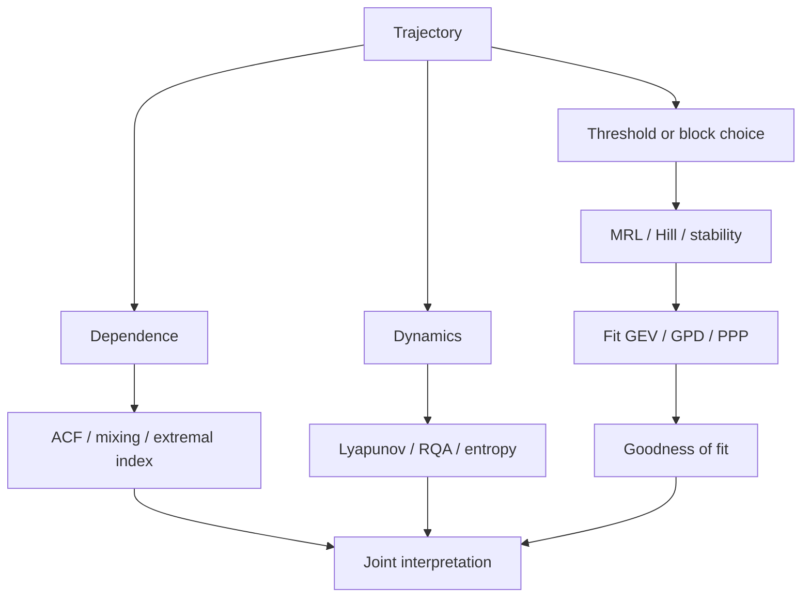

# Diagnostics

Extreme-value inference is sensitive to threshold choice, dependence, finite samples, and misspecification. For chaotic systems, diagnostics should cover both the tail model and the generating dynamics.

## Threshold diagnostics

For threshold \(u\), the mean excess is

\[
e(u)=\mathbb E[X-u\mid X>u].
\]

For an ideal GPD tail, \(e(u)\) is approximately linear over an appropriate threshold region.

```r
thresholds <- quantile(
  x,
  seq(0.85, 0.99, by = 0.01)
)

mrl <- mean_residual_life(x, thresholds)
mrl_plot(mrl)
```

Hill diagnostics are available through `hill_estimates()` and `hill_plot()`.

## Dependence and mixing

Use `acf_decay()`, `compute_autocorrelation()`, `mixing_coefficients()`, and `d_check()`.

!!! note
    A weak autocorrelation function does not imply weak extremal dependence. Linear correlation and clustering of rare events answer different questions.

## Recurrence analysis

`recurrence_plot()` constructs a recurrence matrix after phase-space embedding. `rqa()` summarizes recurrence structure.

```r
qa <- rqa(
  x,
  embed = 3,
  delay = 1,
  lmin = 2,
  vmin = 2
)
```

RQA includes recurrence rate, determinism, laminarity, diagonal-line summaries, trapping time, and entropy.

## Lyapunov diagnostics

A positive largest Lyapunov exponent is a standard signature of sensitive dependence on initial conditions.

Use `estimate_lyapunov_exponent()`, `lyapunov_spectrum()`, `lyapunov_spectrum_continuous()`, and system-specific wrappers.

## Correlation dimension

`estimate_correlation_dimension()` estimates an effective attractor dimension from scaling behaviour. Finite-sample dimension estimates are sensitive, so inspect the scaling region rather than reporting one number without context.

## Symbolic dynamics

`symbolize()`, `block_entropy()`, and `source_entropy()` provide symbolic-complexity summaries of the orbit.

## EVT goodness of fit

Use `validate_extreme_model()` and `goodness_of_fit_test()`. A single p-value is not a validation strategy.

## Diagnostic stack



The idea is triangulation. No single plot certifies an extreme-value model.